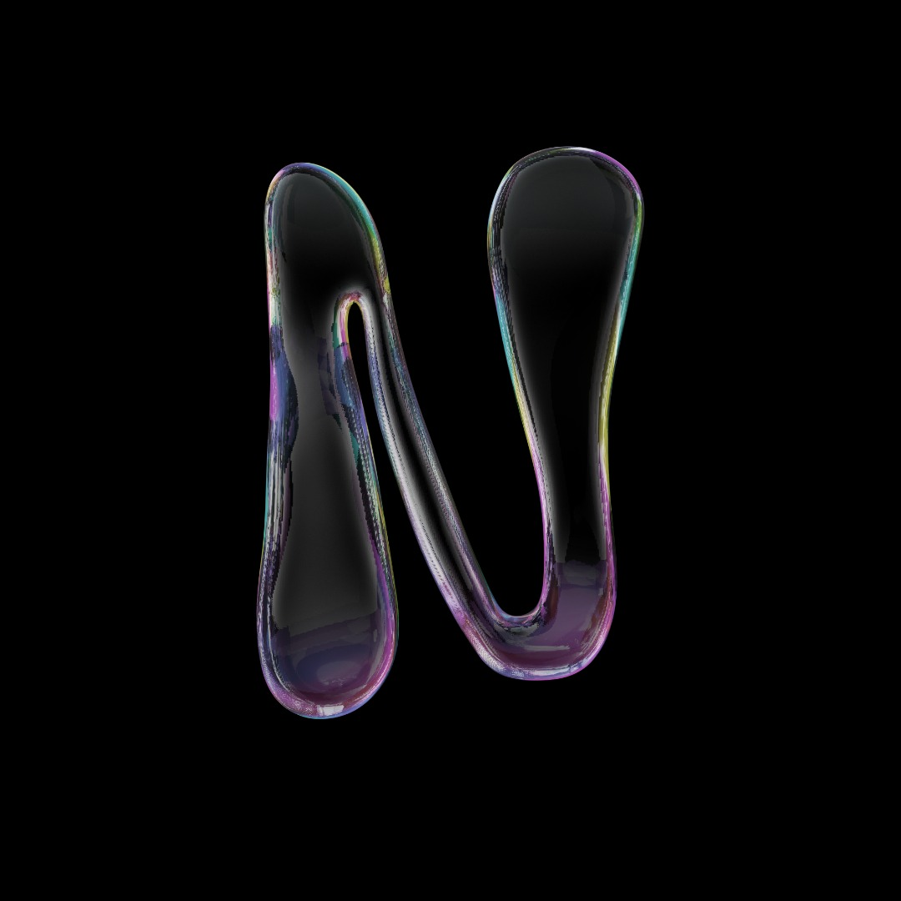
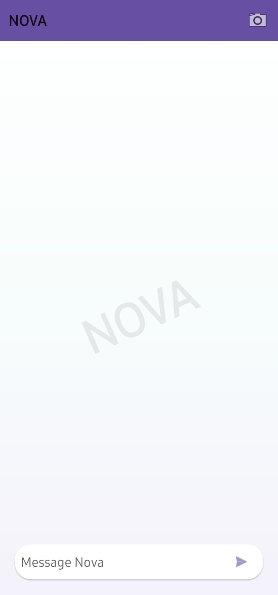
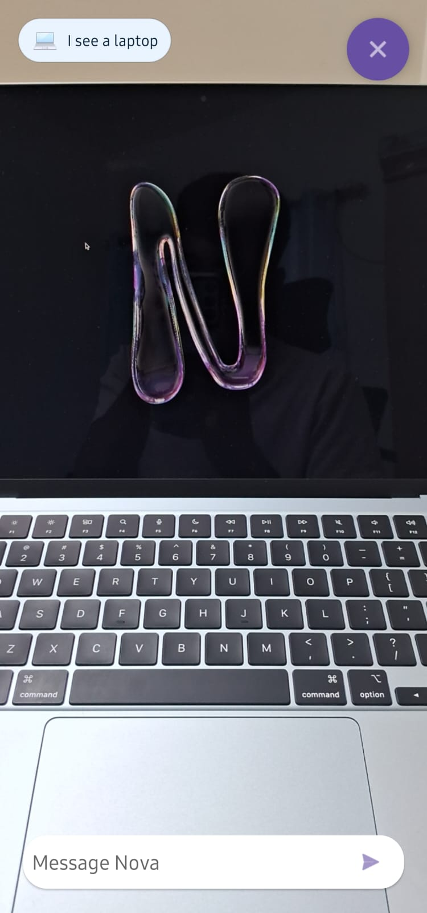
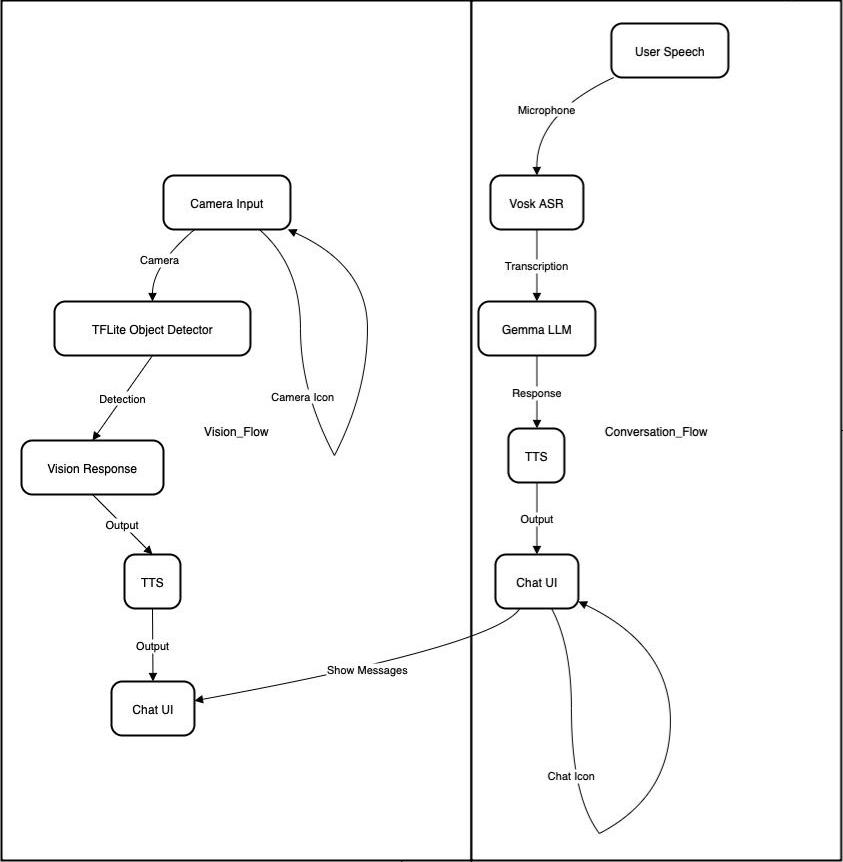

#  Samsung EnnovateX 2025 AI Challenge Submission  

- **Problem Statement** – #2 Building the Untethered, Always-On AI Companion 
- **Team name** – IdeaFlow  
- **Team members** – Nitheeswaran M, Sree Ram Roshan A S  
- **Demo Video Link** – [YouTube Link](https://youtu.be/JQ_UYD9q5aM?si=h1Um2VMUCo4pI-Dj)

---


# NOVA – Offline AI Companion with Vision & Voice

<p align="center">
  
</p>

<p align="center">
  <b>Offline-first AI assistant for Android</b><br>
  Voice | Vision | Chat — all on-device, no cloud required.
</p>

---

## 📖 Overview

**NOVA** is an Android application that brings together:

- 🗣️ **Offline Speech Recognition** (Vosk)  
- 💬 **On-device LLM inference** (MediaPipe GenAI `.task` bundles)  
- 📷 **Real-time Object Detection** (TensorFlow Lite EfficientDet)  
- 🔊 **Text-to-Speech** (Android TTS)  

Unlike most assistants that rely on cloud APIs, NOVA is **offline-first**, designed for privacy, low-latency responses, and accessibility in areas without reliable internet.  
Think of it as a **ChatGPT-style experience** + **computer vision awareness** — but entirely on-device.  

---

## ✨ Features

- **Conversational Chat UI** inspired by ChatGPT  
- **Wake words**: “Hey Nova”, “Ok Nova”  
- **Camera Vision Mode**: describes objects (*“I see a laptop”*)  
- **Offline operation**: all models run locally  
- **Voice feedback** with natural Text-to-Speech  
- **Material Design**: app bar, watermark branding, chat bubbles  

<p align="center">
  
  
</p>

---

## 🏗️ Architecture

<p align="center">
  
</p>

**Data Flow:**

```
Conversation:
User Speech → Vosk ASR → LLM (MediaPipe GenAI) → TTS + Chat UI

Vision:
Camera → TensorFlow Lite Detector → NOVA Response → TTS + Overlay
```

---

## 📂 Project Structure

```
NOVA-main/
│── app/
│   ├── src/main/java/com/example/nova/
│   │   ├── MainActivity.kt        # Core activity: chat + vision
│   │   ├── MyVoskService.java     # Vosk integration
│   │   ├── llm/LlmEngine.kt       # MediaPipe LLM wrapper
│   │   ├── ObjectDetector.kt      # TFLite object detection
│   │   ├── CommandRouter.kt       # Intent routing
│   │   └── util/ZipSanity.kt      # Model bundle validator
│   ├── src/main/res/layout/activity_main.xml
│   ├── build.gradle.kts
│   └── ...
├── build.gradle.kts
├── settings.gradle.kts
├── README.md
```

---

## ⚙️ Setup & Installation

### Prerequisites
- Android Studio **Arctic Fox (2020.3.1)** or newer  
- Android SDK 24+  
- Gradle KTS  

### Steps

1. **Clone the repo**
   ```bash
   git clone https://github.com/your-username/NOVA.git
   cd NOVA-main
   ```

2. **Open in Android Studio**  
   Sync Gradle and let dependencies install.

3. **Build & Run**
   ```bash
   ./gradlew assembleDebug
   adb install app/build/outputs/apk/debug/app-debug.apk
   ```

---

## 📦 Model Download & Setup

The Gemma `.task` model is **not included in this repository** because of GitHub’s file size limits.  
Instead, download it directly from **Hugging Face**:

### 🔗 Download Link
- [Gemma3-1B-IT `.task` model (Q4, EKV2048)](https://huggingface.co/litert-community/Gemma3-1B-IT/blob/main/Gemma3-1B-IT_multi-prefill-seq_q4_ekv2048.task)

### 📂 Where to Place the Model
After downloading:

1. Copy the file to your **phone’s Downloads folder**:
   ```
   /storage/emulated/0/Download/Gemma3-1B-IT_multi-prefill-seq_q4_ekv2048.task
   ```

2. Open the **NOVA app** → when prompted, **import the model**.  
   The app will validate the `.task` file and move it into its **private storage**:
   ```
   /data/data/com.example.nova/files/models/Gemma3-1B-IT_multi-prefill-seq_q4_ekv2048.task
   ```

3. Once imported, you’ll see:
   ```
   Model imported: Gemma3-1B-IT_multi-prefill-seq_q4_ekv2048.task (xxxx MB). Say something…
   ```

✅ From now on, the app will **auto-load** the Gemma model at startup.

⚠️ **Note on performance**:  
- First-time warm-up may take **30–60 seconds** (model graph compilation).  
- Runs fully **offline** after that.  
- Works best on devices with **6GB+ RAM**.

---

## 🧑‍💻 Tech Stack

- **Kotlin + Java** – core development  
- **Material Design Components** – UI  
- **Vosk Android** – offline ASR  
- **MediaPipe Tasks GenAI** – LLM inference  
- **TensorFlow Lite** – object detection  
- **Android TTS** – voice feedback  
- **Gradle (KTS)** – build system  
- **Min SDK:** 24  
- **Target SDK:** 34  

---

## 🚀 Roadmap

- [ ] Hybrid cloud fallback (if internet available)  
- [ ] Persistent conversation memory  
- [ ] Multilingual speech + text support  
- [ ] Optimized models for AR/wearables  

---

## 🤝 Contributing

Contributions, issues, and feature requests are welcome!  
Please check the [issues page](https://github.com/your-username/NOVA/issues).  

---

## 📜 License

Distributed under the MIT License. See `LICENSE` for details.  

---

## 🙌 Acknowledgements

- [Vosk](https://alphacephei.com/vosk/)  
- [MediaPipe](https://developers.google.com/mediapipe/)  
- [TensorFlow Lite](https://www.tensorflow.org/lite)  
- [Hugging Face – Gemma3-1B-IT](https://huggingface.co/litert-community/Gemma3-1B-IT)  
